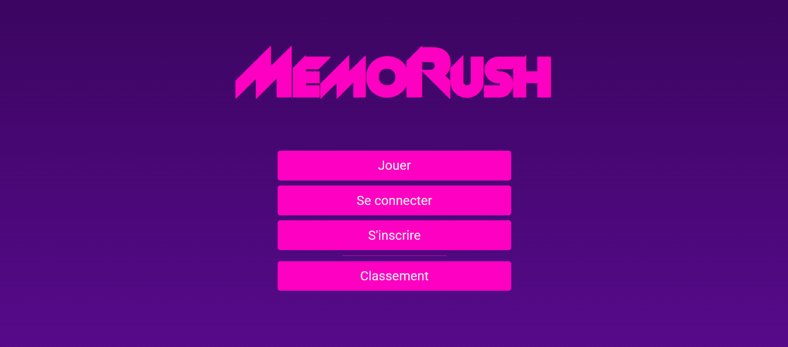
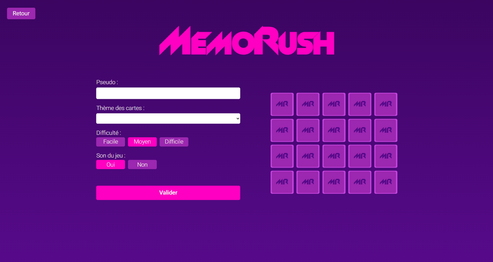
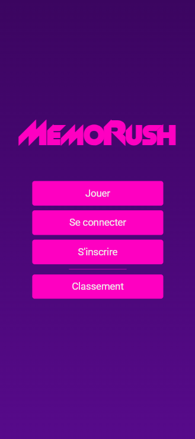
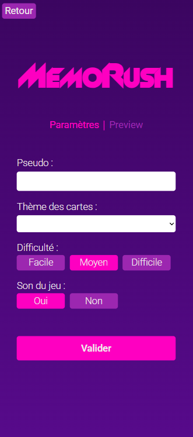

# MemoRush

    


MemoRush est une application web de type jeu de memory, développée avec Angular pour le frontend et Node.js/TypeScript pour le backend.
Ce projet est encore en cours de développement, mais l’objectif est de proposer une expérience ludique et compétitive autour de la mémoire visuelle et de la rapidité.

Les joueurs pourront se connecter, choisir leur niveau de difficulté et leur thème de cartes, puis tenter de réaliser le meilleur score.

## 🌐 Démo

(Bientôt disponible)


## 📸 Aperçu
**Desktop**




**Mobile**




(Captures d’écran à venir)


## ✨ Fonctionnalités prévues

- 🎯 Trois niveaux de difficulté (facile, intermédiaire, difficile)

- 🖼️ Plusieurs thèmes de cartes (animaux, objets, icônes, etc.)

- 👤 Connexion utilisateur pour conserver ses scores

- 🏆 Système de scoring basé sur : 
    - le nombre de coups joués

    - le temps écoulé pendant la partie

- 📊 Classement et historique des parties (via le backend)

---
## ⚡ Installation & Lancement en local
#### Prérequis

- Node.js (version 22.14.0 ou supérieure recommandée)

- Angular CLI (npm install -g @angular/cli)

<br>

1. **Cloner le projet**  
```bash
git clone https://github.com/WilliamDodart/MemoRush.git
cd memorush
```

2. **Installer les dépendances**
```bash
npm install
``` 


3. **Lancer l’application en mode développement**
```bash
ng serve
``` 


4. **Accéder au projet :**

Ouvrir http://localhost:4200 dans le navigateur.